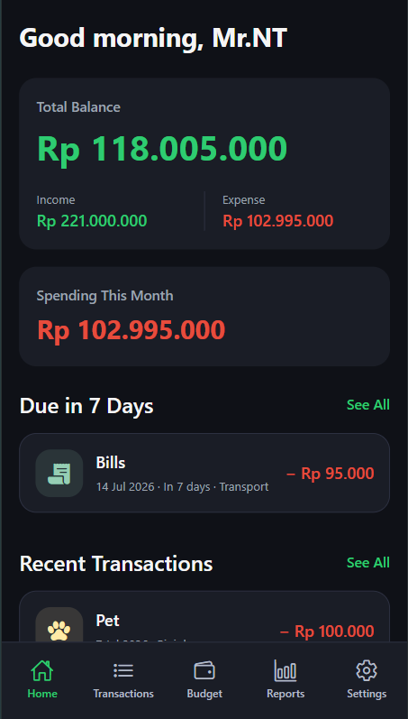
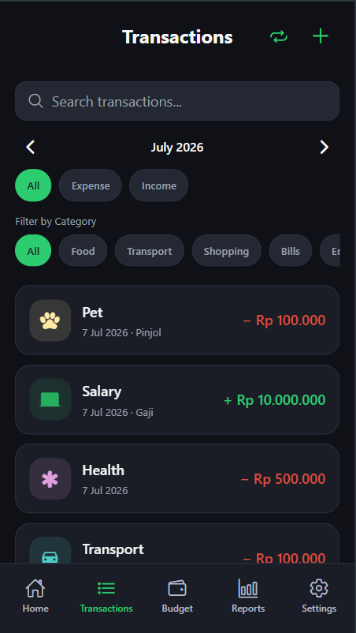
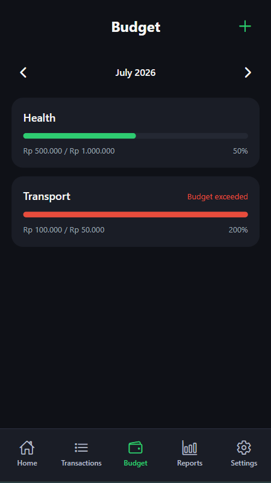
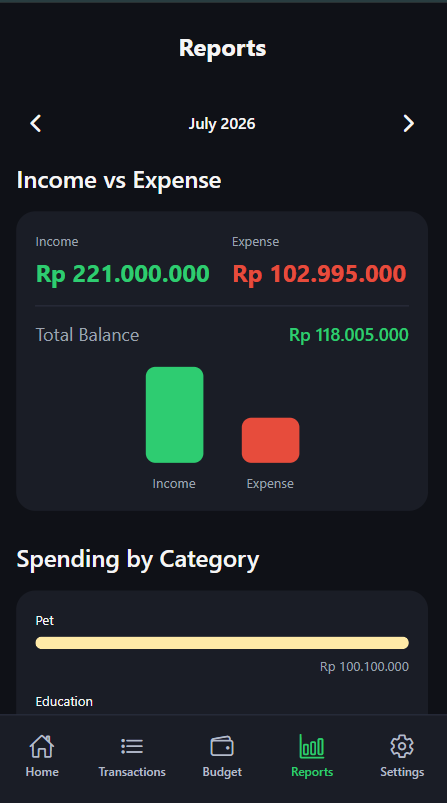
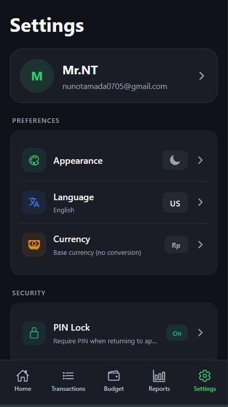
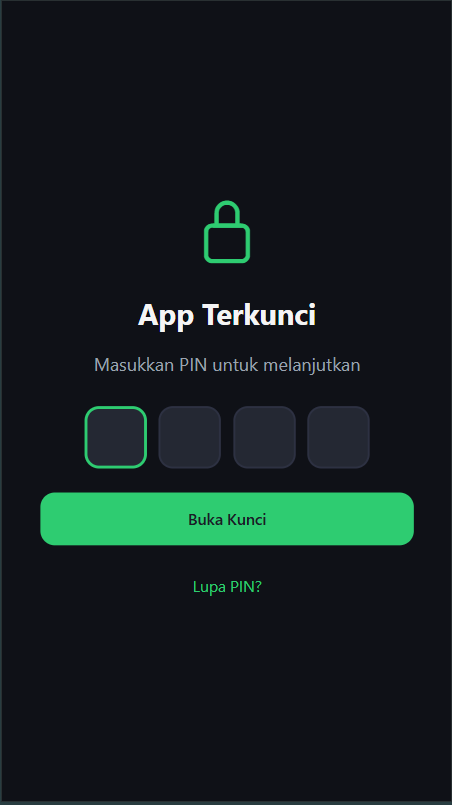
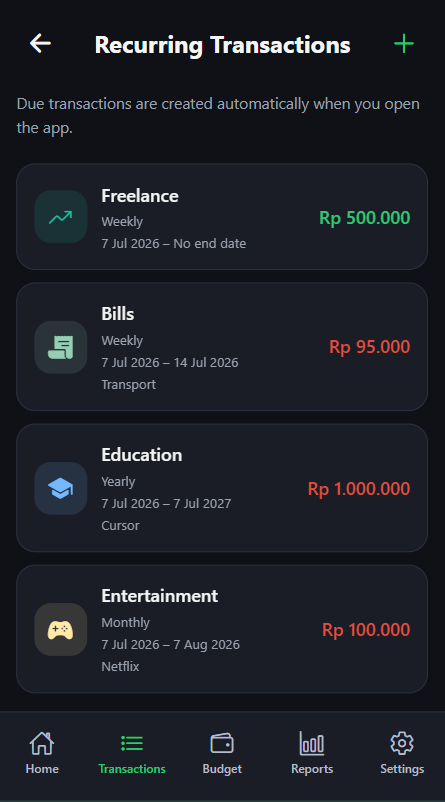
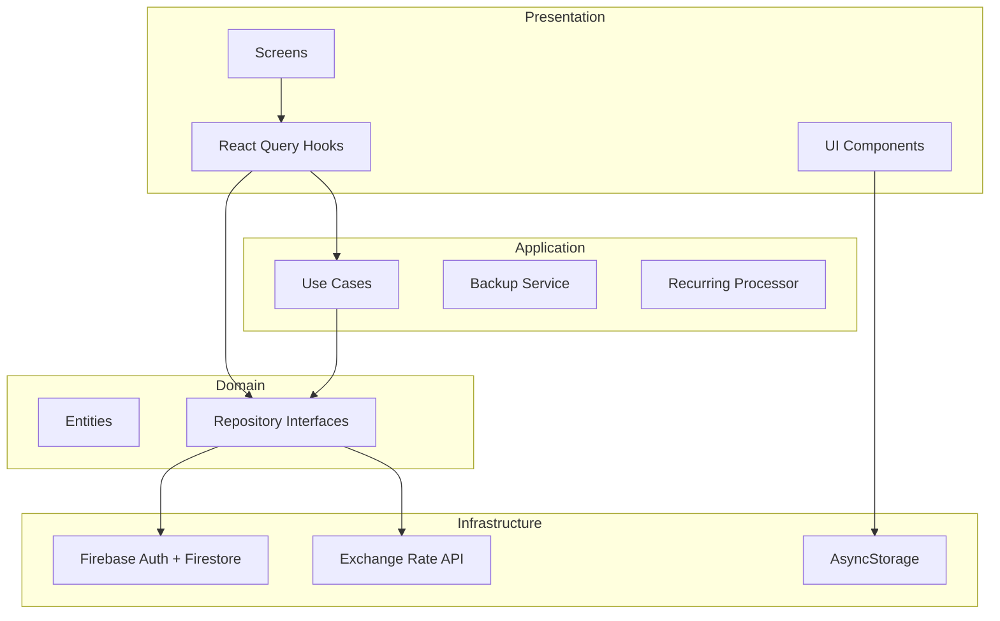

# Money Tracker

> **Cross-platform personal finance app** — Expo · TypeScript · Firebase · React Native Web

**Repository:** [github.com/EvosROAR/money-tracker](https://github.com/EvosROAR/money-tracker)  
**Live demo:** _Deploy Vercel — lihat [docs/VERCEL_DEPLOY.md]([./docs/VERCEL_DEPLOY.md](https://money-tracker-pearl-eight.vercel.app/))_

Aplikasi pencatat keuangan pribadi dengan sinkronisasi cloud, multi-mata uang, anggaran, transaksi berulang, dan keamanan PIN/biometrik. Berjalan di **Web**, **Android**, dan **iOS**.

**Status:** Portfolio-ready · GitHub published · Vercel deploy berikutnya

---

## Portfolio Highlights

### Ringkasan (copy-paste ke LinkedIn / CV)

**ID:** Aplikasi keuangan pribadi full-stack berbasis Expo + TypeScript + Firebase. Satu codebase untuk web & mobile, arsitektur layered (domain → infrastructure → presentation), real-time sync Firestore, konversi mata uang live, anggaran per kategori, transaksi berulang otomatis, dan keamanan PIN/biometrik.

**EN:** Full-stack cross-platform personal finance app (Expo, TypeScript, Firebase). Single codebase for web & mobile with clean architecture, Firestore sync, live currency conversion, category budgets, auto recurring transactions, and PIN/biometric lock.

### Yang bisa dipamerkan di interview

| Topik | Detail |
|-------|--------|
| **Arsitektur** | Clean layering — entities, repository interfaces, Firebase impl, use cases, React Query hooks |
| **State management** | Zustand (client) + TanStack Query (server cache & invalidation) |
| **Validasi** | Zod schemas + React Hook Form di semua form |
| **Keamanan** | Firestore rules per-user, PIN hash lokal, re-auth Firebase untuk reset PIN |
| **i18n** | Indonesia & English via i18next |
| **Multi-platform** | `react-native-web` — dev di browser, production build ke `dist/` |
| **Testing** | Jest unit tests untuk business logic (`currency`, `reports`, `pin`) |

### Alur demo (±2 menit)

1. **Login / Register** → kategori default otomatis ter-seed
2. **Dashboard** → saldo & ringkasan bulan ini
3. **Tambah transaksi** → input dalam USD/EUR, tersimpan sebagai IDR
4. **Anggaran** → progress bar + warning 80%
5. **Transaksi berulang** → buat bulanan, buka ulang app → auto-generate
6. **Laporan** → income vs expense per kategori
7. **Pengaturan** → ganti tema/bahasa/mata uang, atur PIN, backup JSON

### Screenshots

| Dashboard | Transaksi | Anggaran |
|-----------|-----------|----------|
|  |  |  |

| Laporan | Pengaturan | PIN Lock |
|---------|------------|----------|
|  |  |  |

| Transaksi Berulang |
|--------------------|
|  |

### Arsitektur



---

## Fitur

| Modul | Fitur |
|-------|--------|
| **Auth** | Login, register, lupa password, remember me, logout |
| **Dashboard** | Saldo, ringkasan bulan ini, transaksi terbaru |
| **Transaksi** | CRUD, filter bulan/tipe/kategori, pencarian |
| **Transaksi berulang** | Harian/mingguan/bulanan/tahunan, auto-generate saat buka app |
| **Kategori** | CRUD dengan icon & warna, seed default saat register |
| **Anggaran** | Batas per kategori per bulan, progress bar & warning |
| **Laporan** | Income vs expense, pengeluaran per kategori, ekspor JSON |
| **Pengaturan** | Profil, tema, bahasa (ID/EN), mata uang + konversi tampilan |
| **Keamanan** | Kunci biometrik (HP), kunci PIN (web & HP), Firestore rules per user |
| **Data** | Backup & restore JSON (web) |
| **Notifikasi** | Pengingat harian catat pengeluaran (HP) |

### Mata uang

- Data disimpan dalam **IDR** (mata uang dasar).
- Input transaksi & anggaran bisa dalam mata uang tampilan (USD, EUR, dll.) — otomatis dikonversi ke IDR saat simpan.
- Kurs di-cache ±30 menit; fallback ke kurs perkiraan jika offline.

---

## Tech Stack

| Layer | Teknologi |
|-------|-----------|
| Framework | Expo SDK 57, React Native 0.86, TypeScript |
| Navigation | React Navigation v7 (tabs + native stack) |
| State | Zustand (settings, auth), TanStack Query (server data) |
| Backend | Firebase Auth + Cloud Firestore |
| Forms | React Hook Form + Zod |
| i18n | i18next (Indonesia & English) |

---

## Prasyarat

- **Node.js** ≥ 20.19.4 (disarankan; v20.16 masih jalan dengan peringatan)
- **npm** atau **yarn**
- Akun **Firebase** (gratis tier cukup untuk development)
- Untuk mobile: **Expo Go** di HP (opsional)

---

## Instalasi & Menjalankan

```bash
# Clone / masuk ke folder project
cd money-tracker

# Install dependencies
npm install

# Salin environment Firebase
cp .env.example .env
# Isi .env dengan kredensial Firebase Anda (lihat docs/FIREBASE_SETUP.md)

# Jalankan development server
npm start

# Atau langsung per platform:
npm run web      # Browser
npm run android  # Emulator / Expo Go
npm run ios      # Simulator / Expo Go (macOS)
```

Setelah `npm start`, tekan **`w`** untuk web atau scan QR code dengan Expo Go.

> Setelah mengubah `.env`, restart dengan cache bersih: `npx expo start -c`

---

## Konfigurasi Firebase

Panduan lengkap: [`docs/FIREBASE_SETUP.md`](docs/FIREBASE_SETUP.md)

Ringkasan:

1. Buat project di [Firebase Console](https://console.firebase.google.com/)
2. Aktifkan **Authentication** → Email/Password
3. Buat **Cloud Firestore** (production mode + rules sendiri)
4. Deploy security rules:

```bash
firebase login
firebase deploy --only firestore:rules
```

5. Isi `.env` dengan config Web App Firebase

### Struktur Firestore

```
users/{userId}                         → profil user
users/{userId}/categories/{id}         → kategori
users/{userId}/transactions/{id}       → transaksi
users/{userId}/budgets/{id}            → anggaran bulanan
users/{userId}/recurring_transactions/{id} → transaksi berulang
```

---

## Scripts

| Perintah | Keterangan |
|----------|------------|
| `npm start` | Metro bundler + Expo Dev Tools |
| `npm run web` | Buka di browser |
| `npm test` | Jalankan unit tests (Jest) |
| `npm run build:web` | Build static web ke folder `dist/` |
| `npx expo export --platform web` | Sama dengan `build:web` |
| `firebase deploy --only firestore:rules` | Deploy Firestore security rules |

---

## Struktur Project

```
money-tracker/
├── App.tsx                 # Entry: providers + navigation
├── src/
│   ├── domain/             # Entities, repository interfaces
│   ├── infrastructure/     # Firebase repos, exchange rate API
│   ├── application/        # Backup, recurring processor, use cases
│   ├── presentation/       # Screens, components, hooks, navigation
│   ├── store/              # Zustand stores
│   ├── bootstrap/          # AuthBootstrap, providers
│   ├── lib/                # i18n, utils, schemas, constants
│   └── theme/              # Colors, typography, spacing
├── docs/
│   └── FIREBASE_SETUP.md
├── firestore.rules
└── firebase.json
```

### Arsitektur

```
Screen → Hook (React Query) → Repository → Firestore
                ↓
         Domain Entity + Zod validation
```

---

## Deploy

### Web (Vercel) — live demo

1. ✅ Repo sudah di GitHub
2. Import project di [Vercel](https://vercel.com) — panduan lengkap: [docs/VERCEL_DEPLOY.md](./docs/VERCEL_DEPLOY.md)
3. Set environment variables Firebase (sama seperti `.env`)
4. Tambah domain Vercel di Firebase → **Authorized domains**
5. Deploy → update link **Live demo** di README

Build lokal: `npm run build:web` → output `dist/` (`vercel.json` sudah dikonfigurasi)

### Mobile (EAS)

```bash
npm install -g eas-cli
eas login
eas build --platform android   # atau ios
```

File `eas.json` sudah disediakan untuk profile development/preview/production.

---

## Testing

```bash
npm test
```

Unit tests untuk `currency`, `pin`, `recurringDate`, dan `reports` utils.

---

## Roadmap (menuju production)

| # | Item | Status |
|---|------|--------|
| 1 | Automated testing | ✅ Jest + unit tests utils |
| 2 | Deploy production | ✅ `vercel.json` + `eas.json` + `build:web` |
| 3 | Notifikasi / reminder | ✅ Pengingat harian (HP) |
| 4 | Multi-wallet / goals | ⏳ Belum — scope terbesar |
| 5 | Input multi-mata-uang | ✅ Transaksi, anggaran & recurring |
| 6 | Polish & accessibility | ✅ PIN lock web, aria blur navigasi |

---

## Rating Saat Ini

| Aspek | Skor |
|-------|------|
| Fitur inti | 8.5/10 |
| Arsitektur | 8/10 |
| UI/UX | 8.5/10 |
| Production-ready | 7.5/10 |
| **Overall** | **~8.2/10** |

Cocok untuk **pemakaian pribadi**, **portfolio project**, dan **deploy web** (`npm run build:web` → folder `dist/`).

---

## Troubleshooting

| Masalah | Solusi |
|---------|--------|
| `Firebase is not configured` | Pastikan `.env` ada & restart `npx expo start -c` |
| `Missing or insufficient permissions` | Deploy `firestore.rules` (pastikan ada rule `recurring_transactions`) |
| Kurs tidak update di web | Normal jika API gagal — app pakai kurs perkiraan |
| Kunci biometrik tidak muncul | Hanya di HP (Expo Go), tidak di web |
| Kunci PIN | Pengaturan → Keamanan → Kunci PIN (web & HP) |
| Pengingat harian | Hanya HP; butuh izin notifikasi |
| `useNativeDriver` warning | Sudah ditangani di web; aman diabaikan |

---

## Lisensi

Private project — hak cipta pemilik repository.

---

## Kontribusi

Project pribadi. Untuk saran fitur atau bug, buka issue atau hubungi maintainer.
